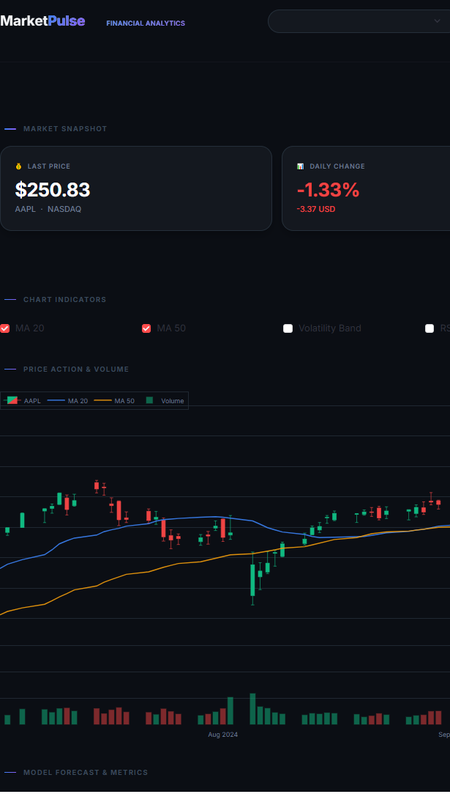

# MarketPulse · Fintech Analytics Platform

> End-to-end Machine Learning pipeline for stock price prediction with a professional financial dashboard.


---

## What is this?

MarketPulse is a **full Data Science project** that downloads real stock market data, engineers features, trains a Machine Learning model, and presents everything in a professional fintech-style dashboard.

Built as a portfolio project to demonstrate end-to-end ML pipeline development — from raw data ingestion to interactive visualization.

---

## Live Demo

> Dashboard running locally on `http://localhost:8501`  
> Tickers analyzed: **AAPL** (Apple) · **MSFT** (Microsoft)

## Dashboard Preview


---

## Features

- **Real-time data ingestion** via Yahoo Finance API
- **Feature engineering** — moving averages, volatility, momentum indicators
- **Random Forest Regressor** trained on 2 years of historical data
- **Next-day price prediction** with confidence scoring
- **Interactive candlestick chart** with MA20, MA50, RSI, Volatility Band toggles
- **15-day forecast** with uncertainty band
- **Monthly performance analysis** with best/worst day breakdown
- **Multi-ticker comparison** normalized to base 100
- **Model metrics panel** — MAE, MAPE, R² Score
- **KPI tooltips** — contextual explanations on hover

---

## Project Architecture

```
marketpulse/
├── config.py                 # Central configuration (tickers, dates, paths)
├── src/
│   ├── ingestion.py          # Module 1: Data download from Yahoo Finance
│   ├── features.py           # Module 2: Feature engineering
│   └── model.py              # Module 3: Random Forest training
├── dashboard/
│   └── app.py                # Module 4: Streamlit dashboard
├── data/
│   ├── raw/                  # Raw OHLCV data (CSV)
│   └── processed/            # Engineered features (CSV)
└── models/                   # Trained models (.pkl)
```

---

## ML Pipeline

### 1. Data Ingestion (`src/ingestion.py`)
Downloads 2 years of daily OHLCV data for each ticker using `yfinance`.

### 2. Feature Engineering (`src/features.py`)

| Feature | Description |
|---|---|
| `close` | Closing price |
| `return_1d` | Daily percentage return |
| `ma_7` | 7-day moving average |
| `ma_21` | 21-day moving average |
| `volatility_7` | 7-day rolling standard deviation |
| `dist_ma7` | Distance from price to MA7 |
| `dist_ma21` | Distance from price to MA21 |
| `target` | Next day's closing price (label) |

### 3. Model Training (`src/model.py`)

- **Algorithm:** Random Forest Regressor
- **Estimators:** 100 trees
- **Split:** 80% train / 20% test (chronological — no data leakage)
- **Metrics:** MAE · MAPE · R² Score
- **Confidence:** Based on inter-tree prediction variance

### 4. Dashboard (`dashboard/app.py`)
Built with Streamlit + Plotly. Bloomberg-style dark theme, fully interactive.

---

## Model Performance

| Ticker | MAE | MAPE | R² |
|--------|-----|------|----|
| AAPL | ~$7 | ~3% | varies |
| MSFT | ~$5 | ~1.5% | ~0.69 |

> Note: Financial price prediction is inherently uncertain. These metrics reflect pattern recognition on historical data, not guaranteed future performance.

---

## Tech Stack

| Layer | Technology |
|-------|-----------|
| Data | yfinance, pandas |
| ML | scikit-learn (RandomForestRegressor) |
| Visualization | Plotly, Streamlit |
| Serialization | joblib |
| Language | Python 3.11 |

---

## Installation & Setup

### 1. Clone the repository
```bash
git clone https://github.com/Jbaigorria22/marketpulse.git
cd marketpulse
```

### 2. Create virtual environment
```bash
python -m venv venv

# Windows
venv\Scripts\activate

# Mac/Linux
source venv/bin/activate
```

### 3. Install dependencies
```bash
pip install -r requirements.txt
```

### 4. Run the pipeline
```bash
# Step 1: Download data
python src/ingestion.py

# Step 2: Engineer features
python src/features.py

# Step 3: Train model
python src/model.py

# Step 4: Launch dashboard
streamlit run dashboard/app.py
```

---

## Configuration

Edit `config.py` to change tickers, date range, or forecast horizon:

```python
TICKERS       = ["AAPL", "MSFT"]   # Add any Yahoo Finance ticker
DATE_START    = "2023-01-01"
DATE_END      = "2025-01-01"
FORECAST_DAYS = 15
```

---

## What I Learned

- Building a **complete ML pipeline** from raw data to deployed interface
- **Feature engineering** for time series — avoiding data leakage with chronological splits
- **Random Forest** internals — using tree variance as a confidence proxy
- **Streamlit** dashboard architecture with session state and caching
- **Product thinking** — designing for the user, not just the data

---

## Roadmap

- [ ] AWS deployment (S3 + Lambda + EventBridge for daily auto-update)
- [ ] Streamlit Cloud hosting
- [ ] Additional tickers support
- [ ] Email alerts when confidence score drops

---

## Author

Built by **Joaquin Baigorria** as part of a Data Science portfolio.  
Open to Data Analyst / Data Scientist roles.

[](https://linkedin.com/in/joaquinbaigorria/)
[](https://github.com/Jbaigorria22)

---

> *Not financial advice. Built for educational and portfolio purposes.*
